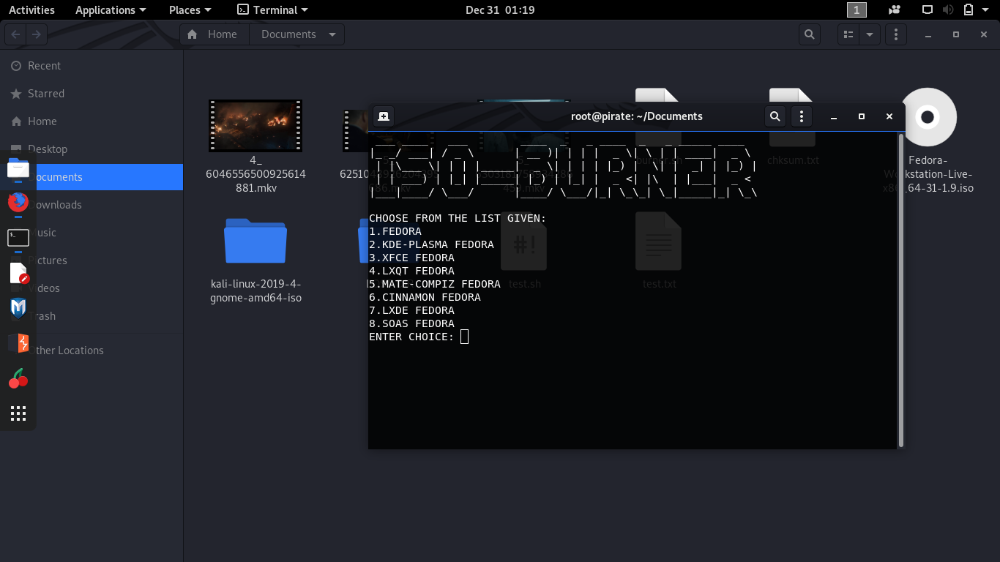

#ISO-BURNER

  * ## Usage:
   Clone the repo in your local machine using:
   ```bash
   $ git clone https://github.com/bashcube/ISO-BURNER.git
   ```
   
   Move into the directory and execute the bash file with sudo privileges:
   ```bash
   $ sudo su
   $ cd ISO_BURNER
   $ bash burner.sh
   ```
   
  * ## Description:
    The following script automates the process of creating a bootable
    Fedora distribution by download the iso from the official site
    (Includes option for spins also), verifies its integrity and then 
    automatically burns the image to the usb drive/stick inserted.
    
  * ## Output:
    
